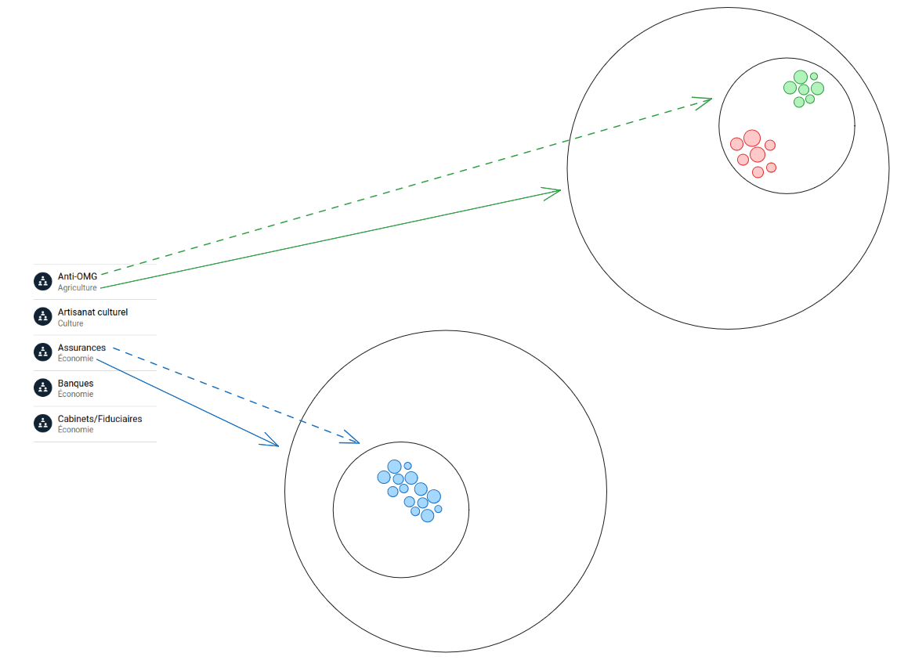
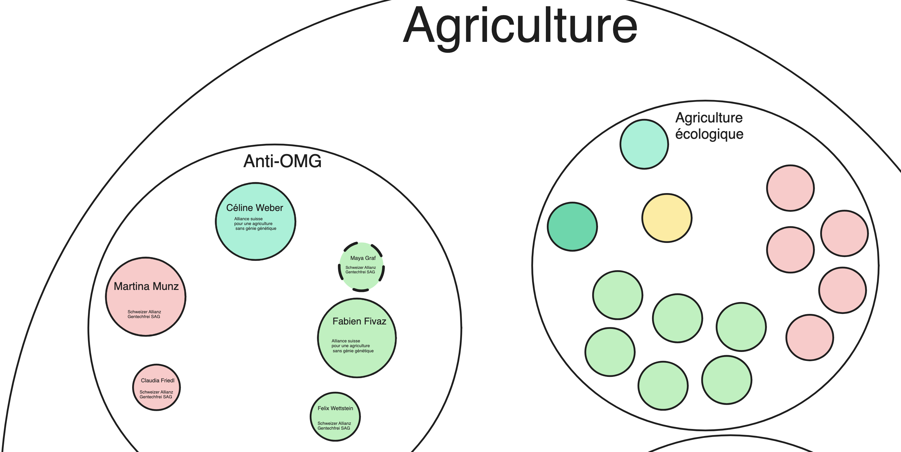

# Project of Data Visualization (COM-480)

| Student's name     | SCIPER |
| ------------------ | ------ |
| Naël Dillenbourg   | 288423 |
| Victor Schneuwly   | 311018 |
| Anne-Laure Tettoni | 295880 |

[Milestone 1](#milestone-1) • [Milestone 2](#milestone-2) • [Milestone 3](#milestone-3)

## Milestone 1 (29th March, 5pm)

**10% of the final grade**

This is a preliminary milestone to let you set up goals for your final project and assess the feasibility of your ideas.
Please, fill the following sections about your project.

_(max. 2000 characters per section)_

### Dataset

The dataset that we want to explore is on this website : https://lobbywatch.ch/fr/node/197.
It is about lobbies, groups of interest and the politicians they are affiliated to in the landscape of Swiss politics. We have information about every currently elected politician, and various groups of interest that are active in Switzerland, as well as the connections between them. In terms of quality, it is already quite clean, although there are a lot of different files that we need to explore to better understand them, and decide which ones are the most relevant for us to use. A step that may also be necessary is translating the feature names from German to English.

### Problematic

With this project, the aim is to create a visualization that will educate and inform Swiss citizens and people living in Switzerland about the work being done in Bern to influence our elected politicians. It will also show the affiliations of certain parties and politicians. We want to continue the project of [Lobbywatch](https://lobbywatch.ch/fr), which is to give better transparency to Swiss politics. We want to create a navigable view that is global, where people can explore parties, politicians and groups of interest without having to navigate across many different pages, as is the case on the website we got the data from. We want to create a visualization to help citizens understand the global patterns in lobby involvement in the parliament better, which will bring a better understanding of Swiss society in general.

### Exploratory Data Analysis

The data has 245 members of parliament, affiliated to 7 parties. The exploration is in the notebook ["exploration.ipynb"](/notebooks/exploration.ipynb). An interesting feature is whether the affiliation to a group of interest is paid or not.

### Related work

The website [Lobbywatch](https://lobbywatch.ch/fr) already contains visualizations, but there isn’t one as broad and general as what we want to do. On the website, one can browse and find each person and see how they are linked to certain groups of interest, as well as the strength of the link. We also see if they are paid or not for their work related to the group of interest.
Our approach is to have one visualization, that regroups the most pertinent information of the data. Here is an inspiring visualization : https://observablehq.com/@d3/zoomable-circle-packing?intent=fork.

## Milestone 2 (26th April, 5pm)

**10% of the final grade**

### Sketch of the final product :




### Tools, lectures needed :

For the main visualization, we will need D3 and JavaScript, covered in lectures 2, 3, 4 (“JavaScript”, “D3”). We will also obviously need data, covered in lecture 4 (“Data”), and ours is in JSON form. We will want the visualization to be interactive (with clickable circles that zoom in or out of the visualization, and that relates to lecture 5 (“Interaction”, “Interactive D3”). We will also try to be careful with colors to create something aesthetically pleasing, as well as meaningful (certain colours will represent certain parties, to be able to give a good ensemble view) (lecture 6 “perception, color”). And lastly, we will want the visualization to be contextualized and for that, lecture 12 (“Storytelling”) will be useful.

### Goals breakdown

- Clean data, keep only useful features, make it usable
- Create main visualization : a big circle for each main category of groups of interest, subcircles inside for more specific categorization (e.g, as in sketch : "Agriculture" has as a subcategory "Anti-OMG"), and inside, smaller circles, each representing a party, with inside the circles representing the people. The background of a person's circle is a specific color, representing the party they belong to, and people of the same party are grouped in the same circle.
- The bigger the person's circle, the more efficient they are (there is a notion of efficience on LobbyWatch's website, here is how it looks on the website : ). If a parliamentary member has several interest connection in the same interest group, we add the efficiency score of each interests. 
- Each person's circle has the title of the related group of interest under their name, and a "$" sign if they were paid for their commitment.
- The border of the circle is different depending on whether or not the relation to the lobby is direct or indirect. Direct means they worked directly with them, indirect means they invited someone who works with them in the parliament. (). So there are two possible borders, one that is a continuous line for direct, and one that is a dashed line for indirect.
- Extra idea : represent the statistical variance in interest groups (for example, the socialist party is very active, while the "Verts libéraux" are less active). So for example, see which parties have a lot of variance in them : some very active people, some very unactive.
- We would also like to have a tree that shows where the user clicked, to facilitate going back up and for clarity.

### Visualization repo

In order to use [github-pages](https://pages.github.com/), we decided to host the code on our own organization's repository. The repository can be found [here](https://github.com/LaTcheam/LaTcheam.github.io/tree/main).

Also, that repository is linked here in a [submodule](https://git-scm.com/book/en/v2/Git-Tools-Submodules) under `visu`.
In order to clone the repository with the submodule, you can use the following command:

```bash
git clone --recurse-submodules https://github.com/com-480-data-visualization/data-viz.git
```

If you already cloned the repository, you can use the following command:

```bash
git submodule update --init --recursive
```

> Note: the submodule is linked to a specific commit on our visualization repository. We will update it before every submission.
> Nonetheless, if you want to see the latest version of the visualization, you can simply click on the submodule link and change the branch to `main`.

## Milestone 3 (31st May, 5pm)
The visualization code is accessible on a second github, linked above. It is hosted on github pages and coded using d3.js. 
**80% of the final grade**

## Late policy

- < 24h: 80% of the grade for the milestone
- < 48h: 70% of the grade for the milestone
